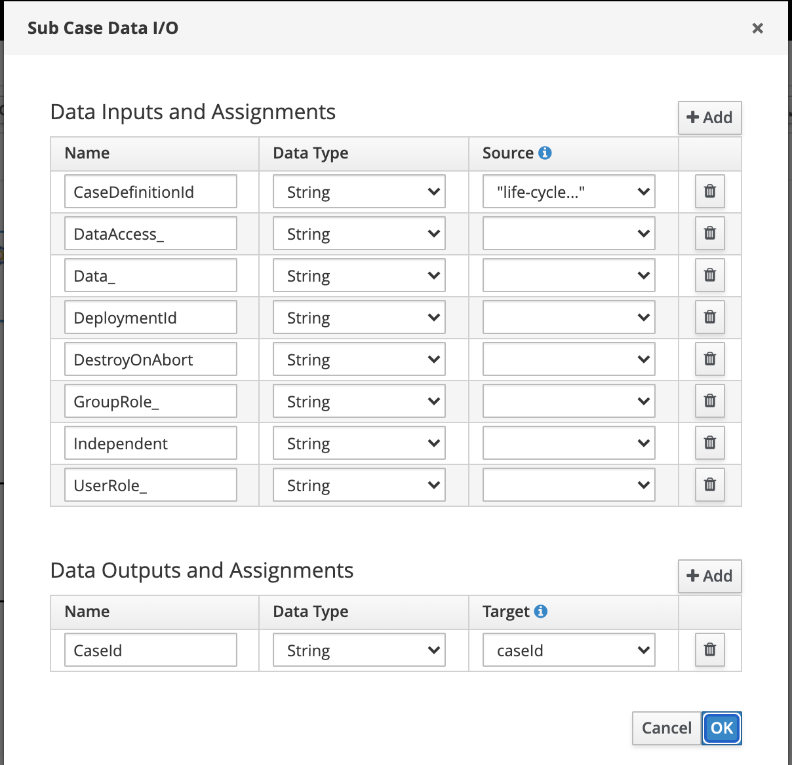

Case Instance from process and it's Life cycle
==============================================
This exmaple provides inforamtion about, how to create a case instance from the process. 

We can use org.jbpm.casemgmt.impl.wih.StartCaseWorkItemHandler to start a case instance from process.

StartCaseWorkItemHandler supports the following set of input parameters to properly configure and start the subcase:

You can read more about these input parameters [here](https://access.redhat.com/documentation/en-us/red_hat_process_automation_manager/7.1/html-single/designing_and_building_cases_for_case_management/index)

Independent property will define the parent instance is independent or dependent.
Optional indicator that tells the process engine if the case instance is independent. If it is independent, the main process instance will not wait for its completion. This property is false by default.

Test this example with Independent = true & false and observe the behaviour.
